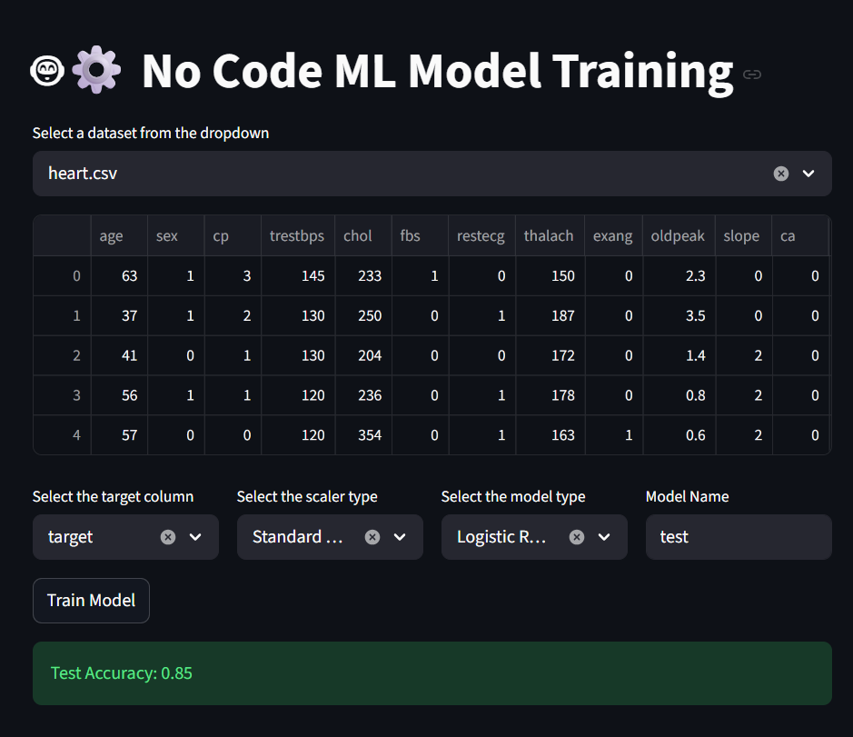

# No Code ML Model Training

A Streamlit-based web application that allows users to train machine learning models without writing any code. Simply select your dataset, configure the parameters, and train your model with one click.


## Features

- **Dataset Selection**: Choose from available CSV datasets in the `datasets/` folder
- **Automatic Preprocessing**:
  - Handles missing values (mean for numerical, most frequent for categorical)
  - Data scaling (Standard Scaler or Min-Max Scaler)
  - One-hot encoding for categorical variables
- **Model Training**: Support for multiple classifiers:
  - Logistic Regression
  - Support Vector Machine (SVM)
  - Random Forest Classifier
  - XGBoost Classifier
- **Model Evaluation**: Automatic accuracy calculation on test set
- **Model Saving**: Trained models are saved as pickle files in the `trained_model/` folder

## Installation

1. Clone or download this repository
2. Install the required dependencies:
   ```bash
   pip install -r requirements.txt
   ```
3. Ensure you have datasets in the `datasets/` folder (CSV format supported)

## Usage

1. Run the Streamlit application:
   ```bash
   streamlit run src/main.py
   ```
2. Open your web browser to the provided URL (usually `http://localhost:8501`)
3. Select a dataset from the dropdown
4. Choose the target column for prediction
5. Select a scaler type (Standard or Min-Max)
6. Pick a model type
7. Enter a name for your model
8. Click "Train Model" to start training
9. View the test accuracy and find your saved model in the `trained_model/` folder

## Project Structure

```
.
├── datasets/           # Place your CSV datasets here
│   ├── diabetes.csv
│   └── heart.csv
├── src/
│   ├── main.py         # Streamlit application
│   └── ml_utility.py   # ML utility functions
├── trained_model/      # Saved trained models (created automatically)
├── requirements.txt    # Python dependencies
└── README.md           # This file
```

## Requirements

- Python 3.7+
- Streamlit
- scikit-learn
- XGBoost
- pandas
- numpy


